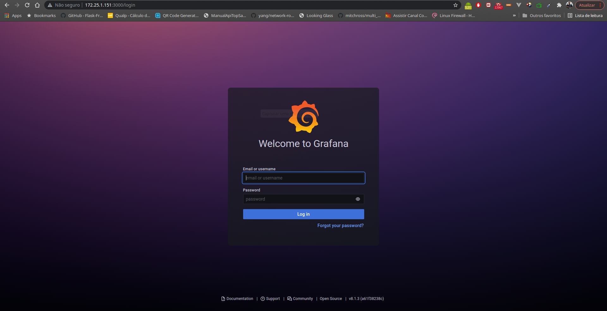
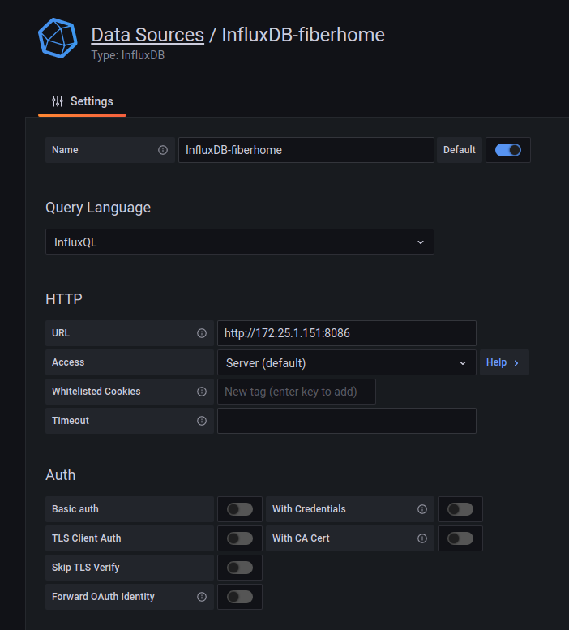
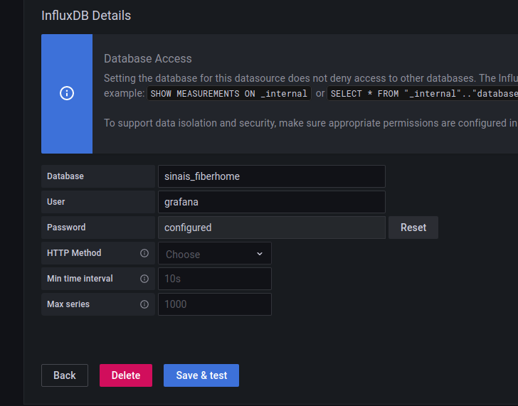
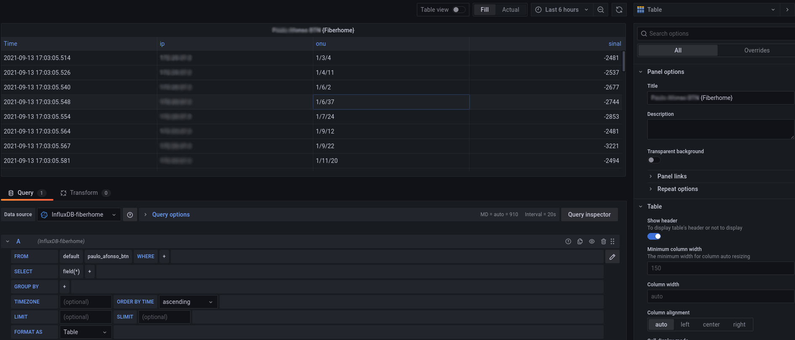

# Sinais Onus

Sistema desenvolvido para coleta de sinais alto em OLTs da Fiberhome e Huawei via SNMP e apresentado em gráficos pelo Grafana.


## 📋 Pré-requisitos
---

Antes de começar, você vai precisar ter instalado em sua máquina o git: [Git](https://git-scm.com). 
Além disto é bom ter um editor para trabalhar com o código como [VSCode](https://code.visualstudio.com/)


## 🔧 Instalação
---

```bash
# Clone este repositório
$ git clone https://github.com/juniormj/sinais_onus.git
```

#### Acesse o diretório do projeto pelo terminal

```bash
$ cd sinais_onus
```

#### Execute o script ***install-docker*** como root

```bash
./install-docker.sh
```

#### Instalação das dependências

```bash
$ pip3 install -r requirements.txt
```

#### Agendando tarefas no crontab
```bash
26,00,00 01,13,17 * * * python /home/User/sinais_onus/start.py Huawei > /tmp/outputhuawei.log 2>&1
27,00,00 01,13,17 * * * python /home/User/sinais_onus/start.py Fiberhome > /tmp/outputfiberhome.log 2>&1
```

#### 
## 📦 Implementação
---

#### Adicionando endereços das OLTs
Caso a OLT de coleta seja Fiberhome adicione o IP e o nome da cidade dentro do arquivo IPs separado por espaço, um abaixo do outro. exemplo.

```
1.1.1.1 cidade1
2.2.2.2 cidade2
3.3.3.3 cidade3
```

E assim segue o mesmo modelo para OLTs da Huawei.

Após ter executado o script ***install-docker*** você poderá perceber que o docker
e o plugins do influxDB já estarão disponíveis.

<table>
    <tr>
        <td></img></td>
        <td></img></td>
    </tr>
</table>

#### Configuração do datasource:

<table>
    <tr>
        <td></img></td>
        <td></img></td>
    </tr>
</table>

#### Criação do dashboard:



## 🛠️ Construído com
---

Abaixo as ferramentas utilizadas para o desenvolvimento desse projeto

* [Docker](https://www.docker.com/) - É uma plataforma de software que permite fazer deploy de serviços.
* [Grafana](https://grafana.com/) - É uma solution open source para análise e monitoramento.
* [InfluxDB](https://www.influxdata.com/) - É um banco de dados de código aberto designado para lidar com alto volume de leituras e escritas por segundo sem causar muito impacto.


## 🖇️ Colaborandores
---

<!-- 
<a href="#" title="Tutoriais">✅</a>
<a href="#" title="Documentacao">📖</a>
<a href="#" title="Design">🎨</a>
<a href="#" title="Codigo">💻</a>
<a href="#" title="Bug reports">🐛</a>
<a href="#" title="Testes">⚠️</a>
<a href="#" title="compilacao">📦</a>
<a href="#" title="Ideas, Feedback">🤔</a>
<a href="#" title="Responder questoes">💬</a>
<a href="#" title="#">📝</a>
-->

<table>
  <tr>
    <td align="center">
    <a href="#">
    
    <br /><sub><b>Inacio</b></sub></a><br /> <a href="#" title="Testes">⚠️</a> <a href="#" title="Ideas, Feedback">🤔</a></td>
    <td align="center"><a href="http://audiolion.github.io"><br /><sub><b>Mauro</b></sub></a><br /><a href="#" title="Ideas, Feedback">🤔</a><a href="#" title="Bug reports">🐛</a></td>
  </tr>
</table>

Contribuições de qualquer tipo são bem-vindas!

## ✒️ Autores
---

<a href="https://www.linkedin.com/in/messias-manoel-da-silva-junior-15004664/">
 
 <br />
 <sub><b>Messias Junior</b></sub></a> 🔞


Entre em contato!

[](https://twitter.com/juniormj1) [](https://www.linkedin.com/in/messias-manoel-da-silva-junior-15004664/) 
[](mailto:juniormj1@gmail.com)


## 📄 Licença
---

Este projeto está licenciado sob a Licença [MIT](http://#)

